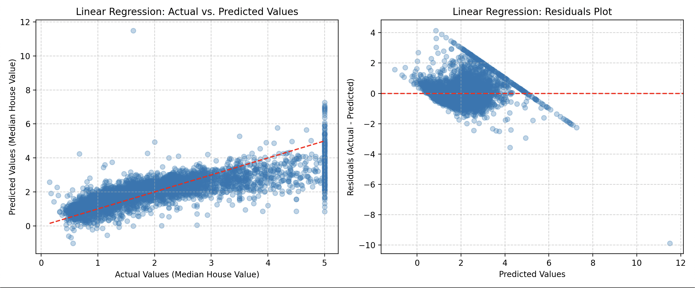
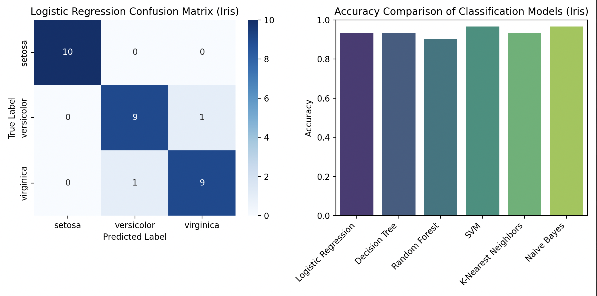
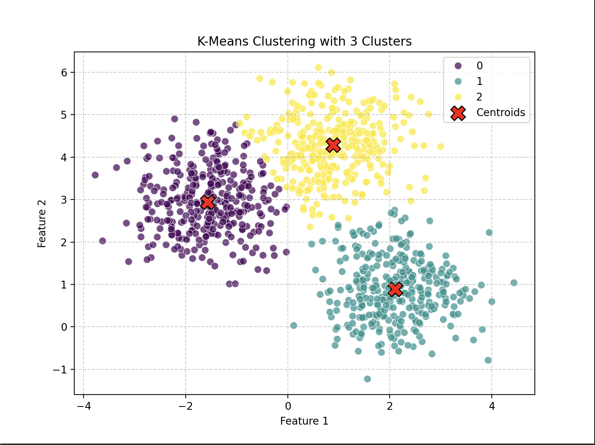
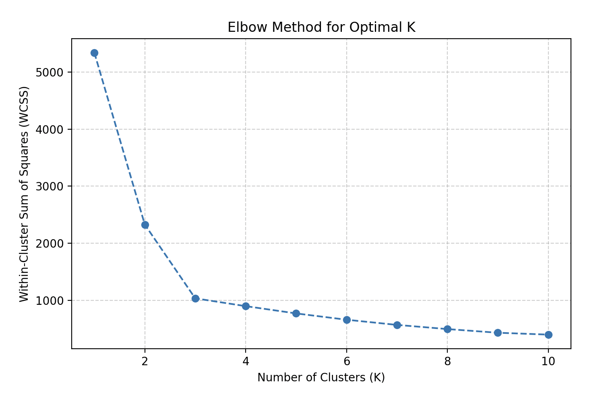
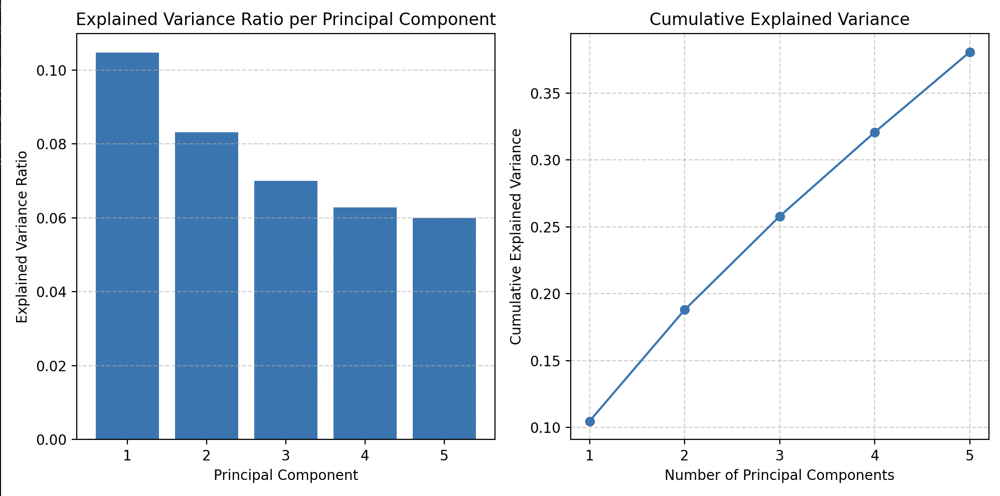
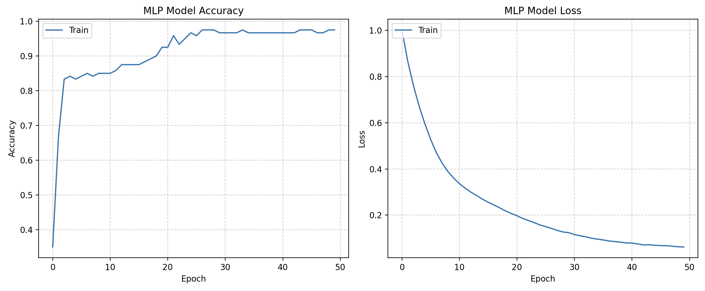
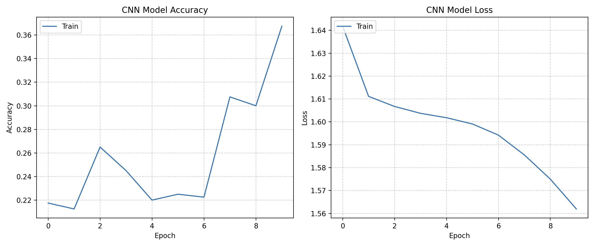
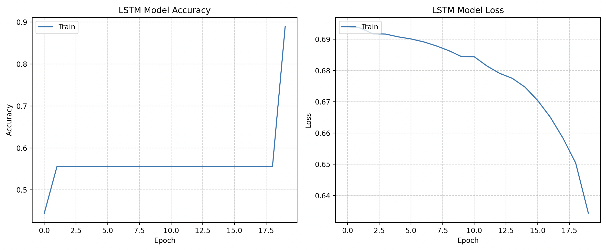

# Machine Learning Algorithm Implementations

Welcome to the Machine Learning Algorithm Implementations project! This repository contains a comprehensive suite of Python scripts demonstrating various supervised, unsupervised, and deep learning algorithms. The goal is to provide clear, executable examples of these fundamental algorithms applied to both synthetic and real-world datasets like the California Housing and Iris datasets, complete with insightful visualizations.

---

## 📚 Table of Contents

- [About This Project](#about-this-project)
- [Features](#features)
- [Getting Started](#getting-started)
  - [Prerequisites](#prerequisites)
  - [Installation](#installation)
  - [How to Run the Code](#how-to-run-the-code)
- [Algorithms Implemented & Performance Overview](#algorithms-implemented--performance-overview)
  - [Supervised Learning](#supervised-learning)
  - [Unsupervised Learning](#unsupervised-learning)
  - [Deep Learning](#deep-learning)
- [Visualizations](#visualizations)
- [Troubleshooting (VS Code & Python Environments)](#troubleshooting-vs-code--python-environments)
- [Contributing](#contributing)
- [License](#license)

---

## About This Project

This repository serves as a practical guide to implementing a wide array of machine learning algorithms. Each algorithm is presented with:

- A clear objective and definition.
- Application on suitable datasets.
- Evaluation metrics (e.g., MSE, Accuracy, Silhouette Score).
- Intuitive visualizations (graphs) to help understand data distributions, model performance, and results.

Whether you're a student learning ML, a developer looking for quick examples, or a practitioner needing a refresher, this project aims to be a valuable resource.

---

## 🚀 Features

- **Diverse Algorithms**: Covers core algorithms from supervised, unsupervised, and deep learning domains.
- **Real & Synthetic Data**: Uses well-known datasets like California Housing and Iris.
- **Comprehensive Evaluation**: Every model is evaluated using appropriate metrics.
- **Integrated Visualizations**:
  - Regression: Actual vs. Predicted, Residual plots
  - Classification: Confusion matrices, Accuracy bar charts
  - Clustering: K-Means plots
  - Dimensionality Reduction: PCA variance plots
  - Neural Networks: Training history
- **Clean Code**: Modular and well-commented for easy understanding.

---

## 🛠️ Getting Started

### Prerequisites

- Python 3.8+ (Python 3.11 recommended)
- `pip`
- Visual Studio Code (or any IDE)

### Installation

Clone the repository:

```bash
git clone https://github.com/AbhigyanD/Machine_Learning-Algos.git
cd Machine_Learning-Algos
```

## 🧠 Algorithms Implemented & Performance Overview

### Supervised Learning

| Algorithm              | Dataset             | Metric   | Value |
|------------------------|---------------------|----------|-------|
| Linear Regression      | California Housing  | MSE      | 0.56  |
| Logistic Regression    | Iris                | Accuracy | 0.93  |
| Decision Tree          | Iris                | Accuracy | 0.93  |
| Random Forest          | Iris                | Accuracy | 0.90  |
| SVM                    | Iris                | Accuracy | 0.97  |
| K-Nearest Neighbors    | Iris                | Accuracy | 0.93  |
| Naive Bayes            | Iris                | Accuracy | 0.97  |

> 🔍 SVM and Naive Bayes achieved the highest accuracy on the Iris dataset.

---

### Unsupervised Learning

| Algorithm          | Dataset           | Metric                    | Value | Additional Info                                  |
|--------------------|-------------------|---------------------------|--------|--------------------------------------------------|
| K-Means Clustering | Synthetic Blobs   | Silhouette Score          | 0.58   | First 10 labels: [0 2 0 0 0 1 0 2 1 2]           |
| PCA                | Synthetic High-Dim| Explained Variance (5 PCs)| 0.38   | Reduced 20 features to 5 components             |

> 📉 The PCA explained variance is low, indicating the need for more components.

---

### Deep Learning

| Algorithm   | Dataset           | Metric   | Value |
|------------|-------------------|----------|--------|
| ANN (MLP)  | Iris              | Accuracy | 0.93   |
| CNN        | Synthetic Images  | Accuracy | 0.12   |
| LSTM       | Synthetic Text    | Accuracy | 0.33   |

> 🧪 CNN and LSTM scores are expectedly low due to the simplicity of the synthetic datasets.

---

## 📊 Visualizations

The script automatically generates:

### Linear Regression:
- Actual vs. Predicted
- Residuals plot

### Classification:
- Accuracy bar chart
- Confusion matrix (where applicable)

### K-Means Clustering:
- Cluster plot
- Elbow method plot


### PCA:
- Explained variance bar chart
- Cumulative variance line plot

### Neural Networks:
- Training loss and accuracy plots



---

## 🛠 Troubleshooting (VS Code & Python Environments)

If you see `ModuleNotFoundError` or squiggly lines:

### ✅ Check Python Interpreter:
- Command Palette → `Python: Select Interpreter`
- Pick: `/opt/homebrew/bin/python3.11` or `venv_ml`

### 🔄 Clear Cache:
- Command Palette → `Python: Clear Cache and Reload Window`

### 🔁 Restart VS Code:
Sometimes a full restart is necessary after changing interpreter settings.

### 🧪 Verify installations:

```bash
which python3.11
python3.11 -c "import tensorflow as tf; print(tf.__version__)"
python3.11 -c "import matplotlib; print(matplotlib.__version__)"
